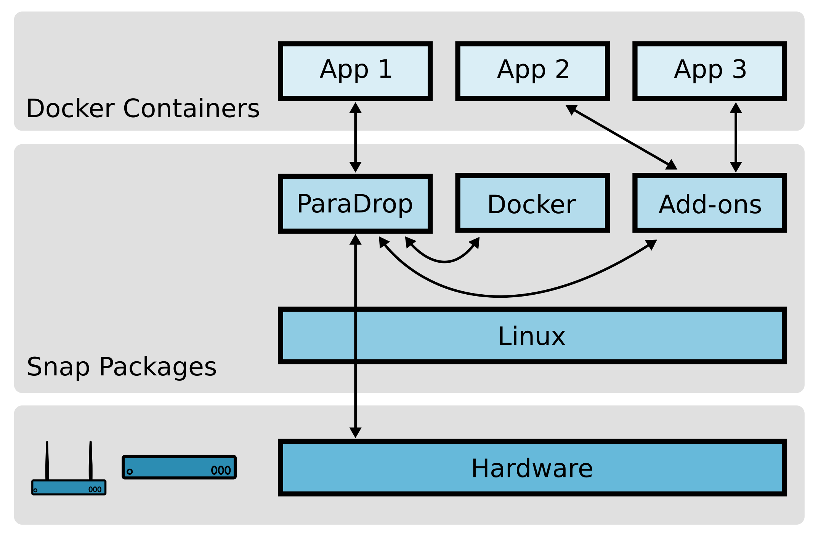
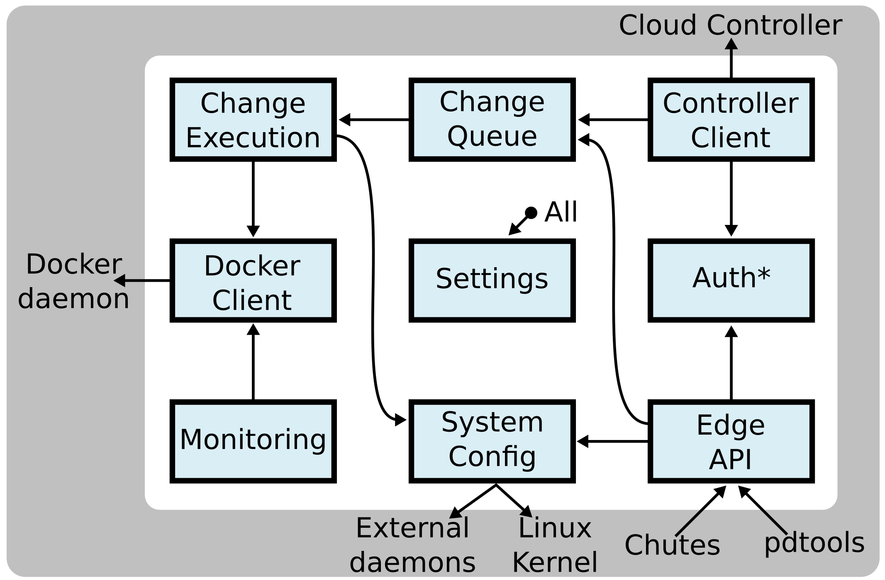
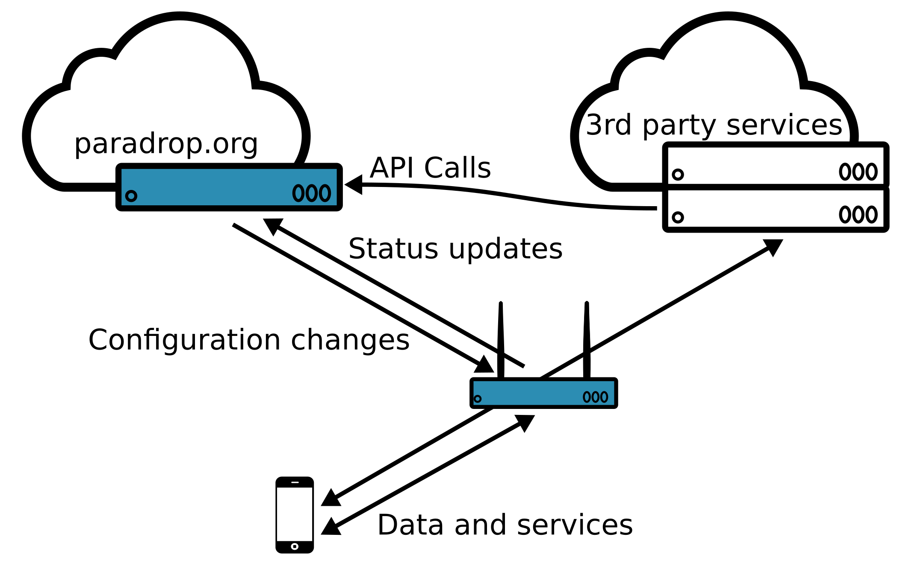
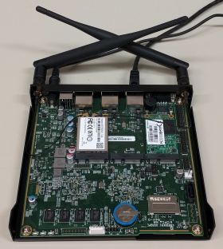

System Architecture
====================================

This section describes some of the important architectural features of
ParaDrop.  Our discussion will cover four major aspects of the ParaDrop
design.

- ParaDrop Edge Compute Node
- ParaDrop Cloud Controller
- ParaDrop Hardware
- ParaDrop API

ParaDrop Edge Compute Node
--------------------------

The defining component of the platform, the edge compute node, is the
computing platform on which your applications and services will run.
We designed the software platform entirely using open source components
such as Linux and Docker. For system-level packages such as Docker and
the ParaDrop daemon, we use snap packages. The snap package format
produces self-contained applications that are then distributed and
installed in a very controlled way.  This keeps the system secure and
safely up-to-date through transactional updates.  Edge services (called
*chutes*) are deployed on the platform as Docker containers. Docker
enables developers to build their services as layers on top of any of
the numerous publicly available images, and complex applications can
even be built by composing and networking multiple Docker containers.
All together, ParaDrop is a powerful but also lean computing platform that
works on a range of hardware from Raspberry Pis to rack-mounted servers.

If we zoom in to the ParaDrop module, we find this is a piece of
software with many responsibilities. We have divided the ParaDrop daemon
roughly into nine submodules which are depicted below. Arrows indicate
dependencies and tell a story about how external events propagate through
the system. This diagram also shows how the ParaDrop daemon on an edge
compute node interacts with other external daemons, tools, and services.

As an example, suppose a developer uses a `pdtools` command to install
a chute on the node. We will describe how this event triggers changes
throughout the system.

1. `pdtools` makes a call to the Edge API to install a chute.
2. Before any changes are made, ParaDrop validates the identity of the
   user and whether the user has permission to perform the operation
   through the Authentication and Authorization (Auth*) module.
3. If there are no problems, ParaDrop then appends the chute
   installation operation to the Change Queue. If there are other changes
   in progress, the chute installation will need to wait before it
   can proceed.
4. The Change Execution engine pops the change off the Change Queue
   and begins the process of installing the chute.
5. Chute installation involves making external changes to the system. Some
   changes are through System Configuration such as starting a child
   process or setting an interface IP address.  Most importantly, though,
   ParaDrop needs to communicate with the Docker daemon in order to run
   the new application code.
6. After the change is complete, the new system state is reflected
   in the Monitoring module, in the information that ParaDrop sends to
   the Cloud Controller, and in any responses to future Edge API requests.

ParaDrop Cloud Controller
-------------------------

The ParaDrop cloud controller is hosted at `paradrop.org
<https://paradrop.org>`_ and provides a central location for tracking
and managing ParaDrop nodes. It also hosts the Chute Store for software
distribution.  Users and developers can sign up for a free account.
For end users and administrators, it provides a dashboard to configure
and monitor all ParaDrop nodes under their control.  The dashboard
also enables users to manage the chutes running on their nodes.
For developers, it provides the interface through which applications can
be registered as ParaDrop chutes available for installation on routers.

Due to the highly distributed nature of edge computing, the central
cloud controller is not strictly required for edge applications to operate.
Each ParaDrop edge node has a publicly-documented local API and can be
directly managed using the `pdtools <https://pypi.org/project/pdtools/>`_
command line utility. Considering this, we have elected not to release
the source code for the cloud controller at this time. If this would
have an impact on your decision to use ParaDrop, please contact us.

ParaDrop Hardware
-----------------

Although the ParaDrop software platform can run on many different types of
hardware, some of its more interesting capabilities are only available on
a physical platform that has wireless network interfaces. Our original
vision for the project has always been to run ParaDrop on high-end Wi-Fi
routers where it serves as the hub for connected IoT devices and can
perform computation along the path between the wireless devices and the
broader Internet.  Our reference implementation uses the `PC Engines
APU2 <https://pcengines.ch/apu2.htm>`_ single board computer with either
one or two 802.11ac Wi-Fi modules.  The image below shows a router built
with a PC Engines APU board.

You can find instructions for running ParaDrop on the PC Engines APU2
board as well as other hardware platforms and virtual machines in the
:doc:`../device/index` section.

ParaDrop API
------------

ParaDrop exports the platform's full capability through an API.  Based on the
functionality and location, the API can be divided into two parts: the cloud
API and the edge API.  The cloud API provides the management interfaces for
applications to orchestrate the chutes from the cloud.  Examples include
resource permission management, chute deployment and management, and router
configuration management.  The edge API exports the local context information
of the routers to the chutes to do some useful things locally.  Examples
include local wireless channel information and local wireless peripheral device
access.
