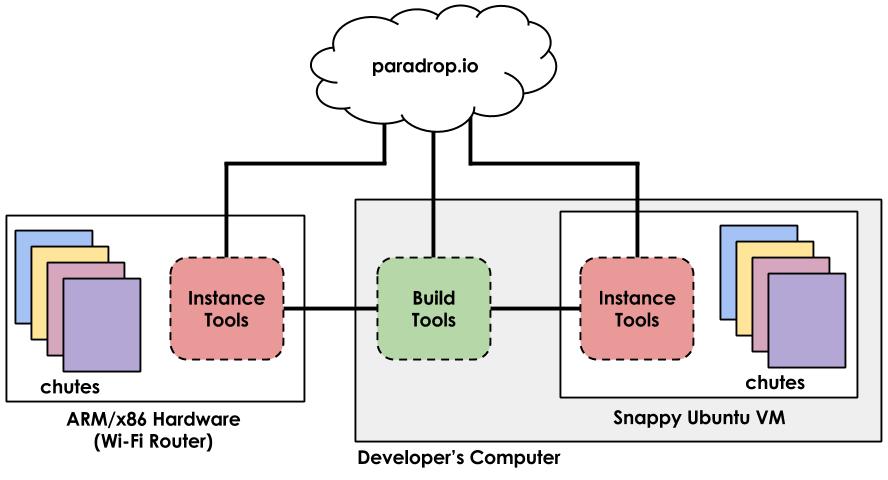

.. paradrop documentation master file, created by
   sphinx-quickstart on Sat Jun 20 18:46:21 2015.
   You can adapt this file completely to your liking, but it should at least
   contain the root `toctree` directive.

.. toctree::
   :maxdepth: 2
   :hidden:

   chutes/chutedev
   pd/paradropdev
   arch/architecture
   issues
   faq

Paradrop
====================================

Paradrop is a software platform that enables apps to run on Wi-Fi routers.
We call these apps "chutes" like a parachute.
The name Paradrop comes from the fact that we are enabling the ability to "drop" supplies and resources ("apps") into a difficult and not well-travelled environment - the home.

Paradrop runs on top of `Snappy Ubuntu <https://developer.ubuntu.com/en/snappy/>`_, a trimmed-down and secured operating system that can run on ARM adn x86.
We also enable our apps through containerization by leveraging `Docker <https://www.docker.com/>`_.

The Paradrop workflow
====================================

There are two components to the Paradrop platform:

* The `build tools <https://pypi.python.org/pypi/pdtools>`_ - our CLI that enables registration, login, and control.  With version 0.2 and up, Paradrop routers can be managed through our `cloud management <https://paradrop.org>`_ service instead of the CLI.
* The `instance tools <https://github.com/ParadropLabs/Paradrop>`_ - our configuration daemons and tools to launch apps on hardware.

As you can see from the image above, we will refer to *Build Tools* when we talk about the CLI program running on your development computer that controls and communicates with the rest of the Paradrop platform.
Treat this tool as your window into the rest of the Paradrop world.
Our *Instance Tools* leverage programs like Docker to allow Paradrop apps to run on router hardware.
This "hardware" could be a Raspberry Pi, or even a virtual machine on your computer that acts as a router (which is why we call it an Instance sometimes).
Using Paradrop, you can actually plug in a USB Wi-Fi adapter and turn a virtual machine on your computer into a real router with our platform!

Getting Started
====================================

Please visit the :doc:`chutes/gettingstarted` page for a quick introduction to Paradrop.

Where to go from here?
====================================

We have advanced app examples found under :doc:`chutes/chutedev`.
If you are interested in working on the instance side of paradrop (our github code) than check out: :doc:`pd/paradropdev`.

.. _no_ubuntu:

What if I don't have Ubuntu?
====================================

With version 0.2 and up, all of Paradrop's capabilities can be managed through our web-based service at `paradrop.org <https://paradrop.org>`_.
